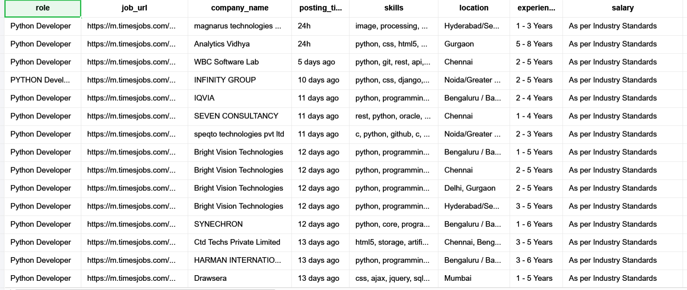

# TimesJobs Scraper - Automated Job Search Tool

An intelligent web scraper that extracts job listings from TimesJobs mobile site and exports them to Excel. Built with Selenium and Pandas for automated job searching across any role or skill.

## 🎯 Features

- 🔍 **Dynamic Search** - Search for any job role via command-line argument
- 📊 **Comprehensive Data** - Extracts Job Role, Company, Location, Experience, Salary, Skills, Posted Date, and Job URL
- 📁 **Excel Export** - Automatically exports to timestamped Excel files
- 🤖 **Smart Scrolling** - Handles lazy loading to capture multiple job listings
- 🛡️ **Bot Detection Bypass** - Includes anti-detection measures for reliable scraping
- ⚠️ **Error Handling** - Skips advertisements and handles missing elements gracefully

## 🛠️ Tech Stack

- **Python 3.x**
- **Selenium WebDriver** - Browser automation
- **Pandas** - Data processing and Excel export
- **openpyxl** - Excel file handling

## 📦 Installation

### 1. Clone the repository
```bash
git clone https://github.com/YOUR_USERNAME/timesjobs-scraper.git
cd timesjobs-scraper
```

### 2. Install required packages
```bash
pip install selenium pandas openpyxl
```

### 3. Download ChromeDriver
- Download from [ChromeDriver Downloads](https://chromedriver.chromium.org/)
- Extract and note the path
- Update the `service` path in the script:
```python
  service = Service(r"YOUR_CHROMEDRIVER_PATH")
```

## 🚀 Usage

### Search for Python Developer jobs (default):
```bash
python timesjobs_scraper.py
```

### Search for any other role:
```bash
python timesjobs_scraper.py "Java Developer"
python timesjobs_scraper.py "Data Analyst"
python timesjobs_scraper.py "Full Stack Developer"
python timesjobs_scraper.py "DevOps Engineer"
```

## 📋 Output Format

The script generates an Excel file with the following columns:

| Column | Description |
|--------|-------------|
| role | Job title/position |
| job_url | Direct link to job posting |
| company_name | Hiring company |
| posting_time | When the job was posted |
| skills | Required skills (comma-separated) |
| location | Job location |
| experience | Required years of experience |
| salary | Salary range (if provided) |
| scraped_at | Timestamp of data extraction |

**Output filename format:** `timesjobs_python_jobs_YYYYMMDD_HHMMSS.xlsx`

## 📸 Sample Output
```
🔍 Searching for: Python Developer
Total jobs available for Python Developer skill or role: 628
no of jobs in the list: 143
 
✅ SUCCESS! Data exported to: timesjobs_python_jobs_20251108_123045.xlsx
📊 Total jobs scraped: 143
🔒 closed the driver
```


## ⚠️ Important Notes

### Partial Job Extraction
This scraper extracts jobs from the **currently loaded page** (typically 100-150 jobs after scrolling). It does **not** extract all available jobs due to:
- **Lazy loading limitations** - The mobile site loads jobs progressively
- **Performance considerations** - Scrolling through all 500+ jobs would take significant time
- **Rate limiting** - Excessive scrolling may trigger bot detection

**Total jobs shown:** May display 500-600 jobs available  
**Jobs actually scraped:** Typically 100-150 jobs  

This is suitable for getting a good sample of current job postings. For comprehensive data collection, pagination support would need to be implemented.

### Known Limitations
- Some jobs may have missing salary information (displayed as empty)
- Advertisement slots are automatically filtered out
- Very recent postings (< 1 hour) may not have all details populated
- Mobile site structure may change over time, requiring script updates

## 🔧 How It Works

1. **Navigates** to TimesJobs mobile site
2. **Enters search term** in the skills/role field
3. **Scrolls page** 15 times to trigger lazy loading (loads ~100-150 jobs)
4. **Extracts data** from each visible job listing
5. **Filters out** advertisement slots using exception handling
6. **Processes data** using Pandas DataFrame
7. **Exports** to Excel with timestamp

## 🎓 Key Features Explained

### Smart Element Detection
- Skips non-job elements (ads, banners) using try-except blocks
- Handles missing data fields gracefully (e.g., salary not disclosed)
- Validates job elements before extraction

### Anti-Bot Detection
- Custom User-Agent headers to mimic real browsers
- WebDriver property masking to avoid detection
- Human-like scrolling behavior with delays between scrolls

### Lazy Loading Support
- Scrolls 15 times with 1-second intervals between scrolls
- Loads significantly more jobs than initial page load (29 → 100-150)
- Balances between data collection and scraping speed

## 🔮 Future Improvements

- [ ] Full pagination support to extract all available jobs
- [ ] Add location-based filtering in search
- [ ] Implement date range filtering for recent postings
- [ ] Support for multiple job portals (Naukri, Indeed, LinkedIn)
- [ ] Database integration for historical tracking and trend analysis
- [ ] CSV export option alongside Excel
- [ ] Salary range analysis and statistics
- [ ] Email notifications for newly posted jobs matching criteria

## 🐛 Troubleshooting

### "No jobs found" error
- Verify the search term is valid and commonly used
- Check internet connection stability
- Try a more general job role (e.g., "Developer" instead of "Senior Python Django Developer")

### ChromeDriver issues
- Ensure ChromeDriver version matches your Chrome browser version
- Download the correct version from [ChromeDriver Downloads](https://chromedriver.chromium.org/)
- Update the executable path in the script

### Timeout errors
- Increase `WebDriverWait` timeout values if internet is slow
- Adjust `time.sleep()` durations in the scrolling section
- Check if TimesJobs site is accessible

### Fewer jobs scraped than expected
- This is normal - script extracts visible jobs after scrolling
- Increase scroll count in the code (change `range(15)` to higher value)
- Note: Too many scrolls may trigger bot detection

## 👨‍💻 Author

**Sainath Banala (Sai)**
- Python Developer
- Automation Enthusiast

Connect: [GitHub](https://github.com/YOUR_USERNAME)

## ⚠️ Disclaimer

This tool is for **educational and personal use only**. Please respect TimesJobs' terms of service and robots.txt. Do not:
- Make excessive requests that could overload their servers
- Use for commercial purposes without permission
- Violate any applicable laws or regulations

Use responsibly and ethically.

## Acknowledgments

- TimesJobs for providing job listings
- Selenium community for comprehensive documentation
- Pandas team for powerful data manipulation capabilities
